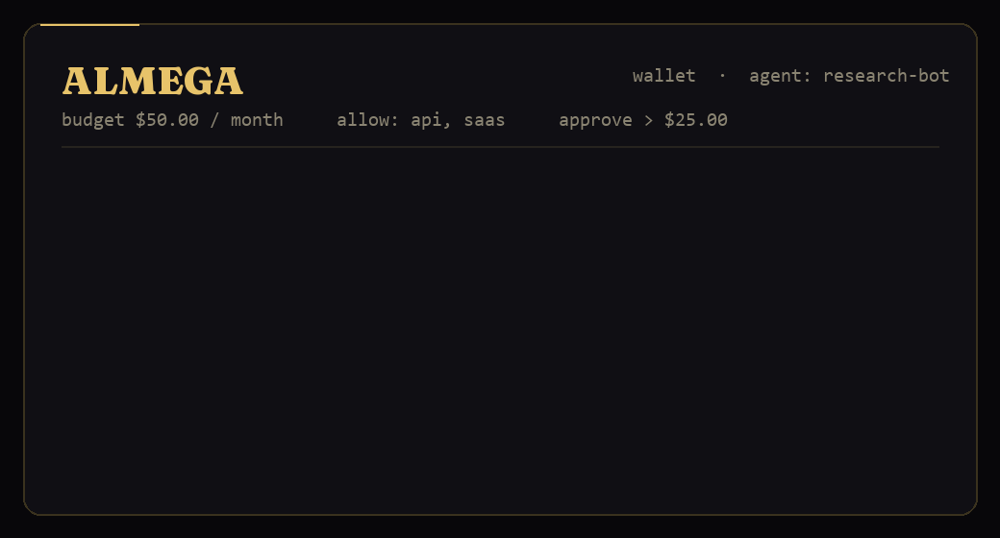

<!-- mcp-name: io.github.almega-ai/almega-mcp -->

# 🧪 Almega MCP — the demonstrator

<p align="center">
  
</p>

> A wallet & guardrail for AI agents, exposed as a Model Context Protocol
> (MCP) server. Drop it into Claude Desktop, the Claude Agent SDK, or any
> MCP-compatible client, and your agent has a wallet with hard limits, a
> human approval step, and a full ledger — instantly.
>
> Ships with **two backends** out of the box:
>
> - `memory` (default): everything in-process. Zero setup.
> - `stripe`: real Stripe Issuing test-mode Cardholders + virtual Cards.
>   No real money. You watch the dashboard light up live.

---

## Tools the server exposes

| Tool | What it does |
|------|--------------|
| `open_wallet(agent_id, monthly_limit, allow, approve_above)` | Give an agent a wallet (and a real Stripe card if backend=stripe) |
| `pay(agent_id, merchant, amount, category)` | Agent tries to spend — gets `APPROVED`, `BLOCKED`, or `AWAITING_YOU` |
| `approve_pending(transaction_id)` | Human says yes to a held transaction |
| `reject_pending(transaction_id, reason)` | Human says no |
| `get_wallet(agent_id)` | Current balance & rules |
| `list_transactions(agent_id?, status?, limit)` | View the ledger |
| `reset()` | Wipe the local index (Stripe entities are kept) |

Plus two resources:

- `almega://wallets` — pretty-printed list of every wallet
- `almega://ledger` — pretty-printed full ledger

---

## Install

From PyPI — the quickest way:

```bash
pip install almega-mcp
# …or run it without installing anything:
uvx almega-mcp
```

Or from a clone of this repo (for hacking on it):

```bash
pip install -r requirements.txt
```

(Installs `mcp[cli]`, `stripe`, and `requests`. Python 3.10+ recommended.)

Also listed in the [official MCP Registry](https://registry.modelcontextprotocol.io/v0/servers?search=io.github.almega-ai/almega-mcp) as `io.github.almega-ai/almega-mcp`.

---

## Option A — Memory backend (30-second demo)

No accounts, no env vars. Just run:

```bash
mcp dev almega_mcp.py
```

That opens the MCP Inspector in your browser. Call `open_wallet`, `pay`,
`approve_pending` by hand and watch the ledger update.

Or run the scripted scenario:

```bash
python demo.py
```

---

## Option B — Stripe Issuing test mode (5 minutes, still $0)

Now the wallet maps to a **real Stripe Cardholder + virtual Card** and every
`pay()` creates a real **test-mode authorization**. You can open the Stripe
dashboard and see Almega's ledger reflected on Stripe in real time.

### Setup

1. Create a free Stripe account: <https://dashboard.stripe.com/register>
2. Activate Issuing in test mode: <https://dashboard.stripe.com/test/issuing/overview>
   (Stripe asks for some business info even in test — fill it in. Nothing
   leaves test mode until you flip "Activate live".)
3. Grab your **TEST** secret key: <https://dashboard.stripe.com/test/apikeys>

### Run

```bash
export STRIPE_SECRET_KEY=sk_test_...
export ALMEGA_BACKEND=stripe
python stripe_demo.py
```

Almega refuses to start if your key isn't `sk_test_...` — there's no path
to accidentally hit live cards from this code.

### What you'll see in the dashboard

- **<https://dashboard.stripe.com/test/issuing/cards>**
  one virtual card per agent, with the agent name on it.
- **<https://dashboard.stripe.com/test/issuing/authorizations>**
  every `pay()` call as a real Stripe authorization, marked
  *approved* or *declined* exactly the way Almega decided.

The wiring is intentionally direct: Almega decides locally, then mirrors
the decision onto Stripe. The next step (Phase 4) flips it: Stripe sends a
webhook to your server and Almega decides *during* the authorization. The
demo here is the synchronous half — both halves expose the same MCP
surface to the agent.

---

## Wire it into Claude Desktop

Edit `~/Library/Application Support/Claude/claude_desktop_config.json` on
macOS (or `%APPDATA%\Claude\claude_desktop_config.json` on Windows):

```json
{
  "mcpServers": {
    "almega": {
      "command": "python",
      "args": ["/absolute/path/to/almega_mcp.py"],
      "env": {
        "ALMEGA_BACKEND": "stripe",
        "STRIPE_SECRET_KEY": "sk_test_..."
      }
    }
  }
}
```

Restart Claude Desktop. Claude can now open wallets, attempt payments,
and ask you to approve sensitive ones — all reflected live in Stripe.

---

## Demo script (copy-paste into Claude)

> Open a wallet for an agent called `research-bot` with a $50 monthly
> limit, allowing `api` and `saas` categories, and requiring approval
> above $25. Then have the agent try the following three payments:
>
> 1. $12 to `openai.com` (category: `api`)
> 2. $30 to `vercel.com` (category: `saas`)
> 3. $800 to `luxury-store.io` (category: `retail`)
>
> Show me the resulting ledger.

You'll see exactly what the landing's "Exhibit A" shows: the first one
approved, the second held for your sign-off, the third blocked.

If you're on the Stripe backend, refresh
<https://dashboard.stripe.com/test/issuing/authorizations> while you run
the prompt — they appear live.

---

## What's deliberately missing (for now)

- **Persistence** — wallets live in memory. Restart wipes the local index.
  On the Stripe backend the Cardholders + Cards stay in Stripe, but the
  link from `agent_id` to them is forgotten.
- **Webhook flow** — for this demo Almega decides synchronously and tells
  Stripe the outcome. Production flips this: Stripe sends an authorization
  webhook and Almega decides on the wire.
- **Multi-tenant** — single global ledger.
- **Auth** — anyone with the MCP connection can do anything.

All of those are by design for this demo. The point is to make the
human-in-the-loop UX and the per-agent budget model **obvious in five
minutes**, not to ship a bank.

---

## Where this fits

```
   ┌─────────────────┐        MCP tools         ┌──────────────┐
   │  Your AI agent  │  ─────────────────────►  │   Almega     │
   │ (Claude, GPT,  │                           │  (this file) │
   │  LangChain…)    │  ◄──── decision ───────  │              │
   └─────────────────┘                           └──────┬───────┘
                                                        │
                                                ALMEGA_BACKEND=
                                                        │
                              memory ◄───────────┬──────►───────── stripe
                              (in-process)       │                  (test mode)
                                                 │
                                                 ▼
                                          ┌──────────────┐
                                          │  Stripe      │
                                          │  Issuing     │
                                          │  test mode   │
                                          └──────────────┘
```

---

## License

MIT — see [LICENSE](LICENSE).
